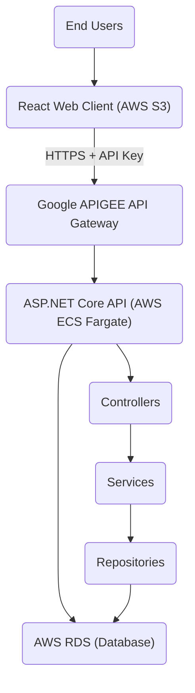

# Real Estate Data API and Web Application

A full-stack cloud-native application for managing real estate properties, users, and realtors. Built with C# ASP.NET Core, React, and deployed on AWS infrastructure with Google APigee API management.

## 📋 Project Overview

This is a Minimal Viable Product (MVP) demonstrating core full-stack development and cloud deployment principles. The system provides a RESTful API for managing real estate data and a React web client for end-user interaction, all deployed on AWS cloud services.

### Key Features

- **RESTful API** with complete CRUD operations for Properties, Users, and Realtors
- **Three-Layered Architecture** (Controller → Service → Repository)
- **Repository Pattern** for clean data access abstraction
- **Entity Framework Core** with AWS RDS database
- **AutoMapper** for DTO-Entity mapping
- **Swagger/OpenAPI** documentation
- **Google APigee** API gateway for security and access control
- **React Frontend** with TypeScript/JavaScript
- **Docker Containerization** with AWS ECS Fargate deployment
- **AWS S3** static website hosting

## 🏗️ Architecture



## 🛠️ Technology Stack

### Backend

- **Framework:** ASP.NET Core 6.0+
- **Language:** C#
- **ORM:** Entity Framework Core
- **Mapping:** AutoMapper
- **Documentation:** Swashbuckle (Swagger)
- **Containerization:** Docker

### Frontend

- **Framework:** React 18+
- **Build Tool:** Vite
- **Language:** TypeScript or JavaScript
- **HTTP Client:** Axios
- **Routing:** React Router

### Cloud Infrastructure

- **Database:** AWS RDS (PostgreSQL/SQL Server)
- **Container Registry:** AWS ECR
- **Container Hosting:** AWS ECS Fargate
- **Static Hosting:** AWS S3
- **API Gateway:** Google APigee

## 📊 Data Models

### Property

- Address, City, State, ZipCode
- Price, Bedrooms, Bathrooms, SquareFeet
- PropertyType, Status
- RealtorId (Foreign Key)
- ListedDate, Description

### User

- FirstName, LastName
- Email, PhoneNumber
- Address
- CreatedDate, IsActive

### Realtor

- FirstName, LastName
- Email, PhoneNumber
- LicenseNumber, Agency
- YearsOfExperience, Specialization
- IsActive

## 🚀 Getting Started

### Prerequisites

- .NET 6.0 SDK or later
- Node.js 16+ and npm
- Docker Desktop
- AWS Account (Free Tier eligible)
- Google Cloud Account (for APigee)
- Visual Studio 2022 or VS Code

### Backend Setup

1. **Clone the repository**

   ```bash
   git clone <repository-url>
   cd RealEstateAPI
   ```

2. **Install dependencies**

   ```bash
   dotnet restore
   ```

3. **Update connection string**

   Edit `appsettings.json`:

   ```json
   {
     "ConnectionStrings": {
       "DefaultConnection": "Server=localhost;Database=RealEstateDB;Trusted_Connection=True;"
     }
   }
   ```

4. **Run migrations**

   ```bash
   dotnet ef database update
   ```

5. **Run the API**

   ```bash
   dotnet run
   ```

6. **Access Swagger UI**

   Navigate to: `https://localhost:5001/swagger`

### Frontend Setup

1. **Create Vite React project**

   ```bash
   npm create vite@latest real-estate-client -- --template react-ts
   cd real-estate-client
   ```


2. **Install dependencies**

   ```bash
   npm install
   npm install axios react-router-dom
   ```

3. **Configure environment variables**

   Create `.env` file:

   ```bash
   VITE_API_BASE_URL=https://your-apigee-url.com/api
   VITE_API_KEY=your-api-key-here
   ```

4. **Run development server**

   ```bash
   npm run dev
   ```

5. **Access the application**

   Navigate to: `http://localhost:5173`

## 🐳 Docker Deployment

### Build Docker Image

```bash
docker build -t real-estate-api .
```

### Run Container Locally

```bash
docker run -p 8080:80 -e ConnectionStrings__DefaultConnection="your-connection-string" real-estate-api
```

### Push to AWS ECR

```bash
# Authenticate Docker to ECR
aws ecr get-login-password --region us-east-1 | docker login --username AWS --password-stdin <account-id>.dkr.ecr.us-east-1.amazonaws.com

# Tag image
docker tag real-estate-api:latest <account-id>.dkr.ecr.us-east-1.amazonaws.com/real-estate-api:latest

# Push image
docker push <account-id>.dkr.ecr.us-east-1.amazonaws.com/real-estate-api:latest
```

## ☁️ AWS Deployment

### AWS RDS Setup

1. Create RDS instance (PostgreSQL or SQL Server)
2. Configure security group for inbound connections
3. Update connection string in ECS task definition
4. Run migrations against RDS database

### AWS ECS Fargate Deployment

1. Create ECS cluster
2. Create task definition with container configuration
3. Configure environment variables (connection string)
4. Run task with public IP enabled
5. Configure security group for HTTP/HTTPS access

### AWS S3 Static Website

1. Create S3 bucket
2. Enable static website hosting
3. Configure bucket policy for public read access
4. Build React app: `npm run build`
5. Upload build files: `aws s3 sync dist/ s3://your-bucket-name`

## 🔐 APigee Configuration

### Setup Steps

1. **Create API Proxy**
   - Target endpoint: Your ECS Fargate URL
   - Proxy endpoint: `/api/*`

2. **Add Verify API Key Policy**

   ```xml
   <VerifyAPIKey name="verify-api-key">
       <APIKey ref="request.header.x-api-key"/>
   </VerifyAPIKey>
   ```

3. **Create API Product**
   - Add all API endpoints
   - Set quota and rate limits

4. **Register Developers**
   - Add at least 2 developers
   - Generate API keys

5. **Create Developer Portal**
   - Enable API key management
   - Publish API documentation

## 📡 API Endpoints

### Properties

- `GET /api/properties` - Get all properties
- `GET /api/properties/{id}` - Get property by ID
- `POST /api/properties` - Create new property
- `PUT /api/properties/{id}` - Update entire property
- `PATCH /api/properties/{id}` - Partially update property
- `DELETE /api/properties/{id}` - Delete property

### Users

- `GET /api/users` - Get all users
- `GET /api/users/{id}` - Get user by ID
- `POST /api/users` - Create new user
- `PUT /api/users/{id}` - Update entire user
- `PATCH /api/users/{id}` - Partially update user
- `DELETE /api/users/{id}` - Delete user

### Realtors

- `GET /api/realtors` - Get all realtors
- `GET /api/realtors/{id}` - Get realtor by ID
- `POST /api/realtors` - Create new realtor
- `PUT /api/realtors/{id}` - Update entire realtor
- `PATCH /api/realtors/{id}` - Partially update realtor
- `DELETE /api/realtors/{id}` - Delete realtor

## 🧪 Testing

### Using Swagger UI

1. Navigate to `/swagger`
2. Expand endpoint
3. Click "Try it out"
4. Enter parameters
5. Execute request

### Using Postman

1. Import API collection
2. Set environment variables (API URL, API Key)
3. Add `x-api-key` header with your APigee key
4. Send requests

### Using Web Client

1. Navigate to deployed S3 URL
2. Use UI to perform CRUD operations
3. Verify data persistence

## 👥 Development Team

This project was developed by a team of 3 developers:

- **Developer 1:** Backend Core & Data Layer (Database, Repositories, DTOs)
- **Developer 2:** API & Cloud Deployment (Controllers, Services, Docker, ECS)
- **Developer 3:** API Management & Frontend (APigee, React Application)

## 📚 Documentation

- **API Documentation:** Available at `/swagger` endpoint
- **Architecture Design:** Comprehensive system design documentation
- **Requirements:** Detailed functional and technical requirements
- **Implementation Guide:** Step-by-step development tasks

## 🎯 Project Goals

- Implement three-layered architecture with Repository Pattern
- Build complete RESTful API with all HTTP methods
- Deploy full-stack application on AWS cloud infrastructure
- Integrate API gateway for security and access control
- Create responsive React frontend consuming the API
- Follow industry best practices and coding standards

## 🔧 Troubleshooting

### Common Issues

**Database Connection Failed**

- Verify RDS security group allows inbound connections
- Check connection string format
- Ensure RDS instance is publicly accessible (for development)

**Docker Build Failed**

- Verify Dockerfile syntax
- Check .NET SDK version compatibility
- Ensure all dependencies are restored

**APigee 401 Unauthorized**

- Verify API key is included in `x-api-key` header
- Check API key is valid and not expired
- Ensure API product includes the endpoint

**React App Can't Connect to API**

- Verify VITE_API_BASE_URL is correct in .env file
- Check CORS configuration on API
- Ensure APigee proxy is forwarding requests

## 📄 License

This project is developed for demonstration and educational purposes.

## 🙏 Acknowledgments

- AWS documentation and tutorials
- Google APigee documentation
- Microsoft ASP.NET Core documentation
- React documentation
- Open source community contributions

## 📞 Contact

For questions or issues, please contact the development team or refer to the project documentation.
