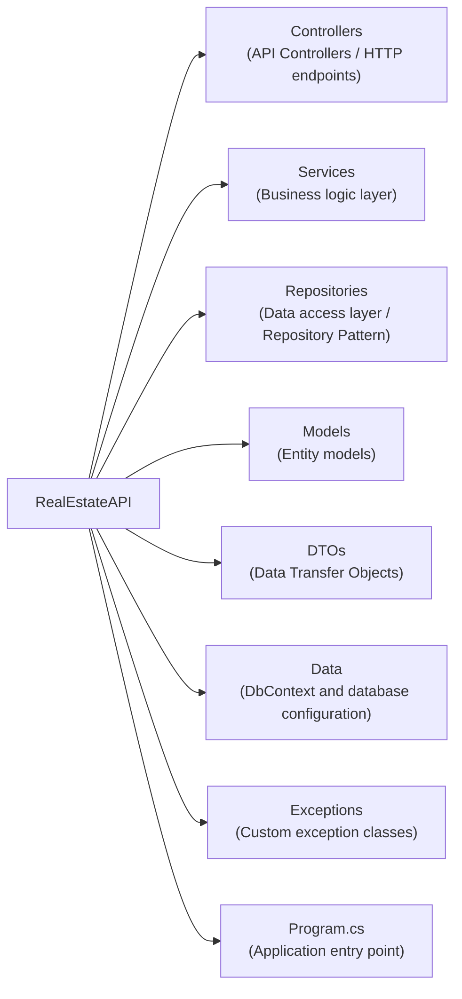

# Real Estate API

A RESTful API for managing real estate properties, users, and realtors built with ASP.NET Core.

## Project Structure



## Technology Stack

- **Framework**: ASP.NET Core 9.0
- **ORM**: Entity Framework Core 9.0
- **Database**: SQL Server (LocalDB for development, AWS RDS for production)
- **Mapping**: AutoMapper 12.0
- **Documentation**: Swagger/OpenAPI
- **Serialization**: Newtonsoft.Json (for JsonPatch support)

## Getting Started

### Prerequisites

- .NET 9.0 SDK
- SQL Server LocalDB (for local development)

### First-Time Setup (For Team Members)

1. **Clone the repository**
   ```bash
   git clone <repository-url>
   cd RealEstateAPI
   ```

2. **Restore NuGet packages**
   ```bash
   dotnet restore
   ```

3. **Apply database migrations**
   ```bash
   dotnet ef database update
   ```
   This creates the local database with the correct schema and seed data.

4. **Run the application**
   ```bash
   dotnet run
   ```

### After Pulling Changes

Whenever you pull changes from the repository, run:

```bash
dotnet restore
dotnet ef database update
```

This ensures you have the latest packages and database schema.

### Running the Application

```bash
dotnet run
```

The API will be available at:

- HTTPS: `https://localhost:7111`
- HTTP: `http://localhost:5045`
- Swagger UI: `https://localhost:7111/swagger`

## Architecture

The application follows a three-layered architecture:

1. **Controller Layer**: Handles HTTP requests and responses
2. **Service Layer**: Contains business logic and validation
3. **Repository Layer**: Manages data access using Entity Framework Core

## API Endpoints

### Properties

- `GET /api/properties` - Get all properties
- `GET /api/properties/{id}` - Get property by ID
- `POST /api/properties` - Create new property
- `PUT /api/properties/{id}` - Update entire property
- `PATCH /api/properties/{id}` - Partially update property
- `DELETE /api/properties/{id}` - Delete property

### Users

- `GET /api/users` - Get all users
- `GET /api/users/{id}` - Get user by ID
- `POST /api/users` - Create new user
- `PUT /api/users/{id}` - Update entire user
- `PATCH /api/users/{id}` - Partially update user
- `DELETE /api/users/{id}` - Delete user

### Realtors

- `GET /api/realtors` - Get all realtors
- `GET /api/realtors/{id}` - Get realtor by ID
- `POST /api/realtors` - Create new realtor
- `PUT /api/realtors/{id}` - Update entire realtor
- `PATCH /api/realtors/{id}` - Partially update realtor
- `DELETE /api/realtors/{id}` - Delete realtor

## Development

### Database Migrations

**⚠️ Important for Team Collaboration:**

- Migrations are tracked in Git and shared across the team
- Everyone must apply the same migrations to maintain database consistency
- **Do NOT create new migrations** without coordinating with the team

Apply existing migrations:

```bash
dotnet ef database update
```

Create a new migration (coordinate with team first):

```bash
dotnet ef migrations add MigrationName
```

### Building

```bash
dotnet build
```

### Testing

```bash
dotnet test
```

## Troubleshooting

### "It works on my machine but not on theirs"

If team members experience issues:

1. **Ensure same .NET version**: Check with `dotnet --version`
2. **Restore packages**: Run `dotnet restore`
3. **Update database**: Run `dotnet ef database update`
4. **Check connection string**: Verify `appsettings.json` points to LocalDB
5. **Clean and rebuild**: Run `dotnet clean` then `dotnet build`

### Database Issues

If you get database errors:

- Delete the local database and run `dotnet ef database update` again
- Ensure SQL Server LocalDB is installed and running

## Deployment

The application is designed to be deployed on AWS infrastructure:

- **Database**: AWS RDS (SQL Server)
- **API**: AWS ECS Fargate (containerized)
- **API Gateway**: Google APigee

## License

This project is for educational purposes.
