# 🚀 START HERE: Task 9 - AWS RDS Deployment

## Welcome to Task 9

You're about to deploy your database to AWS RDS. This guide will help you get started quickly.

## 📋 What You'll Accomplish

By the end of Task 9, you will have:

- ✅ A cloud-hosted database on AWS RDS
- ✅ Your database schema deployed to the cloud
- ✅ 10+ rows of seed data in each table
- ✅ A production-ready database configuration

## ⏱️ Time Required

- **Total**: 20-30 minutes
- **Task 9.1** (Create RDS): 15-20 minutes
- **Task 9.2** (Migrate Data): 5-10 minutes

## 🎯 Choose Your Path

### Path 1: Quick Start (Recommended for First-Timers)

**Best if**: You want step-by-step guidance

1. Open `TASK_9_QUICK_START.md`
2. Follow the condensed steps
3. Use `TASK_9_CHECKLIST.md` to track progress

### Path 2: Detailed Guide (Recommended for Thorough Understanding)

**Best if**: You want comprehensive explanations

1. Open `TASK_9_INSTRUCTIONS.md`
2. Read through prerequisites
3. Follow detailed steps for each subtask

### Path 3: Expert Mode (Recommended for AWS Veterans)

**Best if**: You're familiar with AWS RDS

1. Open `AWS_RDS_SETUP.md`
2. Create RDS instance
3. Run `.\migrate-to-rds.ps1`
4. Run `.\verify-rds-data.ps1`

## 📁 Files You'll Need

### Must Read (Pick One)

- [TASK_9_QUICK_START.md](TASK_9_QUICK_START.md) - Fast track guide
- [TASK_9_INSTRUCTIONS.md](TASK_9_INSTRUCTIONS.md) - Comprehensive guide
- [AWS_RDS_SETUP.md](AWS_RDS_SETUP.md) - AWS-specific details

### Must Use

- `appsettings.Production.json` - Update with your RDS endpoint
- `migrate-to-rds.ps1` - Run this to migrate database
- `verify-rds-data.ps1` - Run this to verify data

### Reference

- [TASK_9_CHECKLIST.md](TASK_9_CHECKLIST.md) - Track your progress
- [TASK_9_COMPLETE.md](TASK_9_COMPLETE.md) - Final checklist

## 🚦 Quick Start (5 Steps)

### Step 1: Create RDS Instance (15 min)

```plaintext
1. Go to: https://console.aws.amazon.com/rds/
2. Click "Create database"
3. Choose SQL Server Express, Free tier, db.t3.micro
4. Set identifier: realestate-db
5. Set username: admin, create password
6. Set initial database: RealEstateDB
7. Enable public access
8. Create database
```

### Step 2: Configure Security (2 min)

```plaintext
1. Go to your RDS instance
2. Click VPC security group
3. Edit inbound rules
4. Add MSSQL (1433) or PostgreSQL (5432)
5. Source: My IP
6. Save
```

### Step 3: Update Connection String (2 min)

```plaintext
1. Open appsettings.Production.json
2. Replace YOUR_RDS_ENDPOINT with your endpoint
3. Replace YOUR_PASSWORD with your password
4. Save file
```

### Step 4: Migrate Database (2 min)

```powershell
cd RealEstateAPI
.\migrate-to-rds.ps1
```

### Step 5: Verify Data (5 min)

```powershell
.\verify-rds-data.ps1
```

Or connect with SSMS/Azure Data Studio and verify 10 rows in each table.

## ✅ Success Criteria

You're done when:

- [ ] RDS instance is "Available"
- [ ] Migration completed without errors
- [ ] Properties table has 10 rows
- [ ] Users table has 10 rows
- [ ] Realtors table has 10 rows

## 🆘 Need Help?

### Common Issues

**Can't connect to RDS?**
→ Check security group allows your IP on port 1433/5432

**Migration fails?**
→ Verify connection string in appsettings.Production.json

**Timeout errors?**
→ Check RDS instance is "Available" and in correct region

### Get More Help

- See [TASK_9_INSTRUCTIONS.md](TASK_9_INSTRUCTIONS.md) → Troubleshooting section
- Check AWS RDS documentation
- Review AWS RDS logs in console

## 💰 Cost Information

- **Free Tier**: 750 hours/month (enough for 24/7)
- **Storage**: 20 GB included
- **Cost**: $0 if within Free Tier limits

**To avoid charges**: Delete RDS instance when done testing

## 🔒 Security Reminder

⚠️ **Important**:

- Never commit passwords to Git
- Use strong passwords for RDS
- Restrict security group to your IP only
- Consider AWS Secrets Manager for production

## 📝 Track Your Progress

Use [TASK_9_CHECKLIST.md](TASK_9_CHECKLIST.md) to track each step:

- [ ] Pre-flight checks
- [ ] Task 9.1 steps
- [ ] Task 9.2 steps
- [ ] Final verification

## 🎉 After Completion

1. Mark tasks complete in `.kiro/specs/real-estate-api/tasks.md`:
   - [x] 9.1 Create AWS RDS instance
   - [x] 9.2 Migrate database to AWS RDS
   - [x] 9. Configure and deploy database to AWS RDS

2. Proceed to Task 10: Containerize API with Docker

3. Keep RDS running (you'll need it for Task 11)

## 🚀 Ready to Start?

1. **Choose your path** (Quick Start, Detailed, or Expert)
2. **Open the corresponding guide**
3. **Follow the steps**
4. **Use the checklist to track progress**
5. **Run the scripts to automate migration**

## 📚 All Available Files

```mermaid
flowchart TD
    A["RealEstateAPI/"]
    A --> B["START_HERE_TASK_9.md ← You are here"]
    B --> C["TASK_9_QUICK_START.md ← Fast track guide"]
    C --> D["TASK_9_INSTRUCTIONS.md ← Comprehensive guide"]
    D --> E["TASK_9_CHECKLIST.md ← Progress tracker"]
    E --> F["TASK_9_COMPLETE.md ← Implementation summary"]
    F --> G["AWS_RDS_SETUP.md ← AWS-specific details"]
    G --> H["migrate-to-rds.ps1 ← Migration automation"]
    H --> I["verify-rds-data.ps1 ← Verification helper"]
    I --> J["appsettings.Production.json ← Configuration file"]

```



## 💡 Pro Tips

1. **Save your credentials**: Write down RDS endpoint and password
2. **Use the scripts**: They handle environment switching automatically
3. **Verify before proceeding**: Make sure data exists before Task 10
4. **Monitor costs**: Check AWS Billing Dashboard regularly
5. **Test connection**: Use SSMS or Azure Data Studio to verify

## 🎯 Your Next Action

**Open one of these files now:**

- [TASK_9_QUICK_START.md](TASK_9_QUICK_START.md) (recommended for beginners)
- [TASK_9_INSTRUCTIONS.md](TASK_9_INSTRUCTIONS.md) (recommended for detailed understanding)
- [AWS_RDS_SETUP.md](AWS_RDS_SETUP.md) (recommended for AWS experts)

Good luck! You've got this! 🚀

---

**Questions?** Check the troubleshooting sections in the guides or review AWS RDS documentation.

**Ready?** Let's deploy your database to the cloud! ☁️
