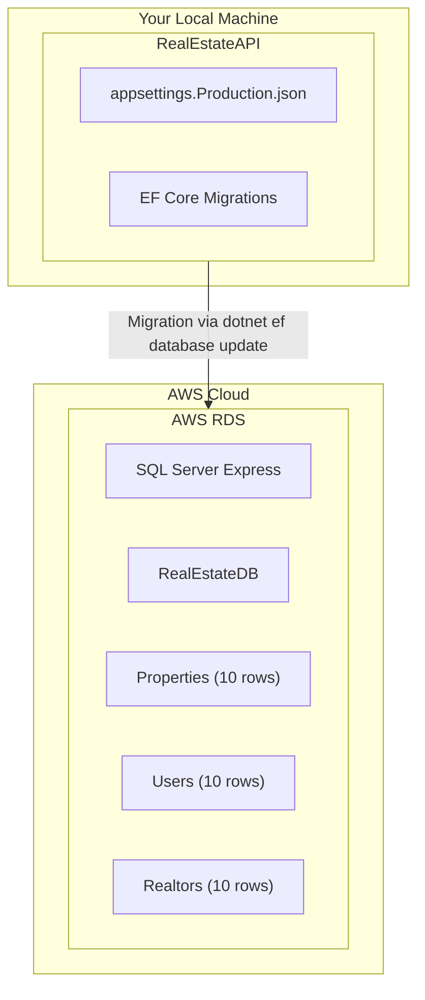

# Task 9 Implementation Summary

## What Was Implemented

Task 9 has been prepared with all necessary configuration files, scripts, and documentation to deploy your database to AWS RDS.

## Files Created

### Configuration Files

1. **appsettings.Production.json**
   - Production environment configuration
   - Template for RDS connection string
   - Ready to be updated with your RDS endpoint

### Documentation

2. **AWS_RDS_SETUP.md**
   - Complete step-by-step AWS RDS setup guide
   - Detailed instructions for both SQL Server and PostgreSQL
   - Security group configuration
   - Connection string examples
   - Troubleshooting guide

3. **[TASK_9_INSTRUCTIONS.md](TASK_9_INSTRUCTIONS.md)**
   - Comprehensive task breakdown
   - Prerequisites and deliverables
   - Detailed steps for both subtasks
   - Troubleshooting section
   - Security notes and cost management

4. **[TASK_9_QUICK_START.md](TASK_9_QUICK_START.md)**
   - Quick reference guide
   - Condensed steps for fast execution
   - Success criteria checklist
   - Common issues and solutions

### Automation Scripts

5. **migrate-to-rds.ps1**
   - Automated migration script
   - Validates configuration before running
   - Sets environment to Production
   - Runs EF Core migrations
   - Provides helpful error messages
   - Resets environment after completion

6. **verify-rds-data.ps1**
   - Data verification helper
   - Guides through verification process
   - Shows expected results
   - Provides connection instructions

### Security

7. **Updated .gitignore**
   - Added note about production settings
   - Reminder to exclude sensitive credentials

## What You Need to Do

### Task 9.1: Create AWS RDS Instance

1. **Go to AWS Console**: <https://console.aws.amazon.com/rds/>
2. **Follow the guide**: Open [AWS_RDS_SETUP.md](AWS_RDS_SETUP.md) or [TASK_9_QUICK_START.md](TASK_9_QUICK_START.md)
3. **Create the instance**:
   - Engine: SQL Server Express or PostgreSQL
   - Instance: db.t3.micro (Free Tier)
   - Database: RealEstateDB
4. **Configure security group**: Allow your IP on port 1433 or 5432
5. **Save credentials**: Note endpoint, username, and password

**Time estimate**: 15-20 minutes (mostly waiting for RDS to provision)

### Task 9.2: Migrate Database to AWS RDS

1. **Update connection string**: Edit `appsettings.Production.json` with your RDS details
2. **Run migration**: Execute `.\migrate-to-rds.ps1`
3. **Verify data**: Run `.\verify-rds-data.ps1` or connect with SSMS
4. **Confirm**: Each table should have 10+ rows

**Time estimate**: 5-10 minutes

## How to Execute

### Quick Path (Recommended)

```powershell
# 1. Create RDS instance in AWS Console (follow TASK_9_QUICK_START.md)

# 2. Update connection string in appsettings.Production.json

# 3. Run migration
cd RealEstateAPI
.\migrate-to-rds.ps1

# 4. Verify data
.\verify-rds-data.ps1
```

### Detailed Path

```powershell
# Follow step-by-step instructions in:
# - AWS_RDS_SETUP.md (for RDS creation)
# - TASK_9_INSTRUCTIONS.md (for complete process)
```

## Success Criteria

✅ **Task 9.1 Complete When:**

- RDS instance created and status is "Available"
- Security group configured to allow connections
- Connection endpoint and credentials saved

✅ **Task 9.2 Complete When:**

- Connection string updated in appsettings.Production.json
- EF Core migrations run successfully against RDS
- Properties table has 10 rows
- Users table has 10 rows
- Realtors table has 10 rows
- Database connectivity tested from local machine

✅ **Task 9 Complete When:**

- Both subtasks are complete
- All success criteria met
- Ready to proceed to Task 10 (Containerization)

## Requirements Satisfied

This implementation satisfies the following requirements from `requirements.md`

- **Requirement 7.1**: API_System connects to AWS_RDS
- **Requirement 7.2**: Database contains 10+ rows per table
- **Requirement 7.3**: Connection strings configured for AWS_RDS
- **Requirement 7.4**: Database connection errors handled gracefully (via EF Core)

## Architecture Impact

After completing Task 9, your architecture will include:



## Next Steps

After completing Task 9:

1. **Mark tasks complete** in `.kiro/specs/real-estate-api/tasks.md`:
   - [x] 9.1 Create AWS RDS instance
   - [x] 9.2 Migrate database to AWS RDS
   - [x] 9. Configure and deploy database to AWS RDS

2. **Proceed to Task 10**: Containerize API with Docker
   - Create Dockerfile
   - Build Docker image
   - Test container locally

3. **Keep RDS running**: You'll need it for Task 11 (ECS deployment)

## Important Notes

### Security

- ⚠️ Never commit real passwords to Git
- ⚠️ Restrict security group to your IP only
- ⚠️ Use strong passwords for RDS
- ⚠️ Consider AWS Secrets Manager for production

### Cost Management

- 💰 Free Tier: 750 hours/month of db.t3.micro
- 💰 Monitor usage in AWS Billing Dashboard
- 💰 Delete RDS instance when done to avoid charges

### Troubleshooting

- 📖 See [TASK_9_INSTRUCTIONS.md](TASK_9_INSTRUCTIONS.md) → Troubleshooting section
- 📖 Check AWS RDS documentation
- 📖 Verify security group and network settings

## Resources

- **AWS RDS Documentation**: <https://docs.aws.amazon.com/rds/>
- **EF Core Migrations**: <https://learn.microsoft.com/en-us/ef/core/managing-schemas/migrations/>
- **SQL Server Connection Strings**: <https://www.connectionstrings.com/sql-server/>
- **Azure Data Studio**: <https://aka.ms/azuredatastudio>

## Questions?

If you encounter issues:

1. Check the troubleshooting sections in the documentation
2. Verify all prerequisites are met
3. Review AWS RDS logs in the console
4. Test connection with SSMS or Azure Data Studio first

## Summary

Task 9 is now ready for execution. All configuration files, scripts, and documentation have been created. Follow the guides to:

1. Create your RDS instance in AWS
2. Migrate your database schema and data
3. Verify everything works correctly

Once complete, you'll have a cloud-hosted database ready for your API deployment! 🚀
